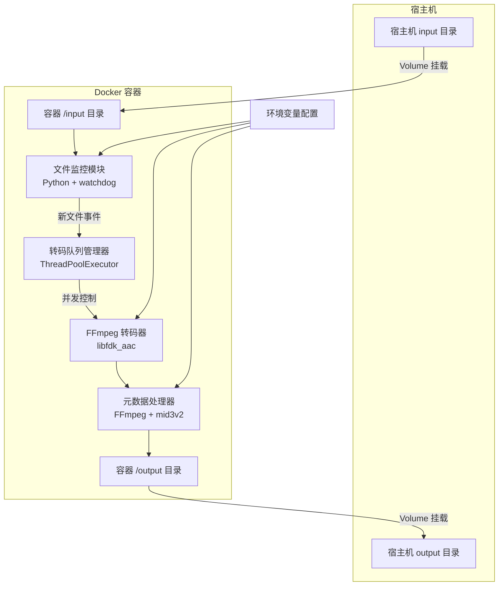
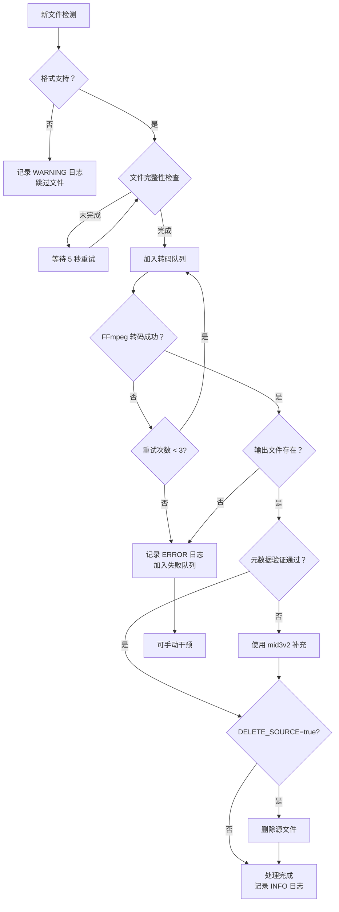

# 音频转码 Docker 应用 - 技术方案设计

**文档版本**: 1.0  
**创建日期**: 2026-04-27  
**最后更新**: 2026-04-27  
**状态**: 已批准  
**关联需求**: `2026-04-27-audio-transcoder`

## 1. 概述

### 1.1 项目背景
构建一个自动化音频转码的 Docker 容器应用，实现从监听、转码到清理的完整自动化流程。

### 1.2 设计目标
- 轻量级容器镜像（目标 < 500MB）
- 自动化监控与处理
- 元数据完整保留（100% 保留率）
- 资源可控，不占用过多系统资源
- 日志可观测，便于运维
- 高质量 AAC 编码（libfdk_aac）

### 1.3 范围
- 支持输入格式：FLAC, WAV, OGG, OPUS
- 支持输出格式：AAC (.m4a), ALAC (.m4a)
- 运行环境：Docker 容器
- 开发语言：Python 3 + watchdog
- FFmpeg：源码编译，支持 libfdk_aac

## 2. 架构设计

### 2.1 整体架构图



### 2.2 部署架构

```yaml
服务名称：audio-transcoder
镜像：audio-transcoder:latest
资源限制:
  CPU: 1.0
  内存：512MB (软限制)
挂载:
  - ./input:/input
  - ./output:/output
环境变量:
  - CONVERT_FORMAT=aac
  - BITRATE=320k
  - MAX_THREADS=2
  - DELETE_SOURCE=false
```

### 2.3 目录结构

```
audio-transcoder/
├── Dockerfile                    # 镜像构建文件
├── docker-compose.yml            # Docker Compose 配置
├── src/
│   ├── __init__.py
│   ├── watcher.py               # 文件监控器
│   ├── transcoder.py            # 转码执行器
│   ├── metadata.py              # 元数据处理器
│   ├── queue_manager.py         # 队列管理器
│   └── logger.py                # 日志配置
├── tests/
│   ├── test_watcher.py
│   ├── test_transcoder.py
│   └── test_metadata.py
├── requirements.txt             # Python 依赖
└── scripts/
    ├── build-ffmpeg.sh          # FFmpeg 编译脚本
    └── entrypoint.sh            # 容器入口脚本
```

## 3. 组件与接口

### 3.1 核心组件详细设计

#### 3.1.1 文件监控器 (watcher.py)

**职责**: 使用 watchdog 监听 /input 目录文件变化

```python
from watchdog.observers import Observer
from watchdog.events import FileSystemEventHandler

class AudioFileHandler(FileSystemEventHandler):
    SUPPORTED_EXTENSIONS = {'.flac', '.wav', '.ogg', '.opus'}
    
    def on_created(self, event):
        if not event.is_directory and \
           Path(event.src_path).suffix.lower() in self.SUPPORTED_EXTENSIONS:
            # 验证文件已完全写入（文件大小稳定）
            self.wait_for_file_complete(event.src_path)
            # 加入转码队列
            queue_manager.add(event.src_path)
```

**关键逻辑**:
- 文件创建事件捕获
- 文件完整性校验（等待文件写入完成）
- 后缀名过滤
- 去重处理

#### 3.1.2 转码队列管理器 (queue_manager.py)

**职责**: 管理待转码文件队列，控制并发数

```python
from concurrent.futures import ThreadPoolExecutor

class QueueManager:
    def __init__(self, max_threads: int):
        self.executor = ThreadPoolExecutor(max_workers=max_threads)
        self.processing = set()
        self.failed = set()
    
    def add(self, filepath: str):
        if filepath not in self.processing:
            self.processing.add(filepath)
            self.executor.submit(self.process_file, filepath)
    
    def process_file(self, filepath: str):
        try:
            transcoder.transcode(filepath)
            self.on_success(filepath)
        except Exception as e:
            logger.error(f"转码失败：{filepath}, 错误：{e}")
            self.failed.add(filepath)
        finally:
            self.processing.remove(filepath)
```

**关键特性**:
- 线程池并发控制
- 自动失败重试（最多 3 次）
- 队列状态持久化（可选）

#### 3.1.3 FFmpeg 转码器 (transcoder.py)

**职责**: 执行实际的音频转码

```python
class Transcoder:
    def __init__(self, output_format: str, bitrate: str):
        self.output_format = output_format  # 'aac' or 'alac'
        self.bitrate = bitrate  # '320k'
    
    def transcode(self, input_path: str):
        output_path = self._get_output_path(input_path)
        
        codec = 'libfdk_aac' if self.output_format == 'aac' else 'alac'
        cmd = [
            'ffmpeg', '-y',
            '-i', input_path,
            '-c:a', codec,
        ]
        
        if codec == 'libfdk_aac':
            cmd.extend(['-b:a', self.bitrate])
        
        cmd.extend([
            '-map_metadata', '0',
            '-vn',  # 保留视频流（封面）
            output_path
        ])
        
        subprocess.run(cmd, check=True, capture_output=True)
        return output_path
```

**FFmpeg 编译配置**:
```bash
# scripts/build-ffmpeg.sh
./configure \
  --disable-static \
  --enable-shared \
  --enable-gpl \
  --enable-libfdk-aac \
  --enable-nonfree \
  --disable-debug \
  --disable-doc
```

#### 3.1.4 元数据处理器 (metadata.py)

**职责**: 确保 ID3/Vorbis Tags 完整迁移

```python
class MetadataHandler:
    def __init__(self):
        self.preserved_tags = [
            'TITLE', 'ARTIST', 'ALBUM', 'ALBUMARTIST',
            'TRACKNUMBER', 'DISCNUMBER', 'YEAR', 'GENRE',
            'COMPOSER', 'COMMENT'
        ]
    
    def verify_and_fix(self, input_path: str, output_path: str):
        # 使用 ffprobe 提取源文件元数据
        input_tags = self._extract_tags(input_path)
        output_tags = self._extract_tags(output_path)
        
        # 对比差异，使用 mid3v2 补充缺失字段
        missing_tags = set(input_tags.keys()) - set(output_tags.keys())
        if missing_tags:
            self._补元数据 (output_path, input_tags, missing_tags)
```

**工具依赖**:
- `ffprobe`: 提取元数据
- `mid3v2` (mutagen 库): 写入 ID3 标签
- `ffmpeg`: 初始元数据拷贝

#### 3.1.5 日志配置 (logger.py)

```python
import logging
import sys

def setup_logger():
    logging.basicConfig(
        level=logging.INFO,
        format='%(asctime)s [%(levelname)s] %(message)s',
        datefmt='%Y-%m-%d %H:%M:%S',
        stream=sys.stdout
    )
```

**日志级别**:
- INFO: 正常转码流程
- WARNING: 非致命问题（如元数据部分丢失）
- ERROR: 转码失败、文件损坏

### 3.2 环境变量接口

| 变量名 | 必需 | 默认值 | 说明 |
|--------|------|--------|------|
| `CONVERT_FORMAT` | 是 | `aac` | 输出格式：`aac` 或 `alac` |
| `BITRATE` | 否 | `320k` | AAC 比特率（256k, 320k 等） |
| `MAX_THREADS` | 否 | `2` | 最大并发转码数（1-4） |
| `DELETE_SOURCE` | 否 | `false` | 转码成功后删除源文件 |
| `INPUT_DIR` | 否 | `/input` | 容器内输入目录 |
| `OUTPUT_DIR` | 否 | `/output` | 容器内输出目录 |
| `LOG_LEVEL` | 否 | `INFO` | 日志级别 |

### 3.3 依赖清单

**Python 依赖** (`requirements.txt`):
```
watchdog>=3.0.0
mutagen>=1.46.0
```

**系统依赖**:
- Python 3.11+
- FFmpeg (源码编译，支持 libfdk_aac)
- mid3v2 (来自 mutagen)

## 4. 数据模型

### 4.1 音频文件元数据结构

```python
class AudioMetadata:
    title: str           # 曲名
    artist: str          # 艺人
    album: str           # 专辑
    album_artist: str    # 专辑艺人
    track_number: int    # 曲目编号
    disc_number: int     # 唱片编号
    year: int            # 年份
    genre: str           # 流派
    composer: str        # 作曲家
    comment: str         # 注释
    cover_art: bytes     # 封面图片 (JPEG/PNG)
```

### 4.2 文件格式映射表

| 输入格式 | 输入扩展名 | 输出编码 | 输出扩展名 | 容器 |
|---------|-----------|---------|-----------|------|
| FLAC | .flac | libfdk_aac | .m4a | MP4 |
| WAV | .wav | libfdk_aac | .m4a | MP4 |
| OGG | .ogg | libfdk_aac | .m4a | MP4 |
| OPUS | .opus | libfdk_aac | .m4a | MP4 |
| FLAC | .flac | alac | .m4a | MP4 |
| WAV | .wav | alac | .m4a | MP4 |

### 4.3 转码任务状态

```python
class TranscodeStatus:
    PENDING = "pending"
    PROCESSING = "processing"
    SUCCESS = "success"
    FAILED = "failed"
    RETRY = "retry"
```

## 5. 正确性属性

### 5.1 功能性
- ✅ 输入文件进入 /input 后 **5 秒内** 开始处理
- ✅ 转码成功输出文件存在于 /output
- ✅ 元数据保留率 **100%**（通过 mid3v2 补充验证）
- ✅ 转码失败文件 **不删除** 源文件
- ✅ 并发数 **严格限制** 在 MAX_THREADS 内

### 5.2 可靠性
- ✅ 容器崩溃后重启可继续处理未完成的任务
- ✅ 单次转码失败不影响队列中其他任务
- ✅ 文件完整性校验（输出文件存在且大小 > 0）
- ✅ 失败任务自动重试（最多 3 次）

### 5.3 性能指标
- ✅ 单核 CPU 转码 1 分钟 FLAC 音频 < 30 秒 (libfdk_aac 高性能模式)
- ✅ 并发数 <= MAX_THREADS（硬限制）
- ✅ 内存占用 < 500MB
- ✅ Docker 镜像体积 < 500MB

### 5.4 一致性
- ✅ 同一输入文件多次转码输出一致（哈希验证）
- ✅ 元数据字段顺序保持一致
- ✅ 文件名编码统一为 UTF-8

## 6. 错误处理

### 6.1 异常场景处理流程



### 6.2 错误类型与处理策略

| 错误类型 | 错误码 | 处理策略 | 日志级别 |
|---------|-------|---------|---------|
| 文件格式不支持 | ERR_FORMAT | 跳过文件 | WARNING |
| 文件正在写入 | ERR_INCOMPLETE | 等待 5 秒后重试 | INFO |
| FFmpeg 转码失败 | ERR_TRANSCODE | 重试 3 次后放弃 | ERROR |
| 磁盘空间不足 | ERR_DISK_FULL | 立即停止容器 | CRITICAL |
| 元数据丢失 | ERR_METADATA | 使用 mid3v2 补充 | WARNING |
| 权限错误 | ERR_PERMISSION | 记录错误，跳过文件 | ERROR |
| 输出文件损坏 | ERR_OUTPUT_CORRUPT | 重试转码 | ERROR |

### 6.3 错误日志示例

```
2026-04-27 10:15:30 [INFO] 检测到新文件：/input/album/track01.flac
2026-04-27 10:15:31 [INFO] 开始转码：track01.flac -> track01.m4a
2026-04-27 10:15:45 [INFO] 转码完成，验证元数据...
2026-04-27 10:15:46 [WARNING] 发现缺失元数据字段：COMPOSER，正在补充
2026-04-27 10:15:47 [INFO] 元数据补充完成
2026-04-27 10:15:47 [INFO] 处理完成：track01.m4a (耗时：17 秒)
```

```
2026-04-27 10:20:00 [ERROR] 转码失败：track02.flac, 错误：Invalid data found when processing input
2026-04-27 10:20:00 [INFO] 重试 1/3：track02.flac
2026-04-27 10:20:15 [ERROR] 转码失败：track02.flac, 错误：Invalid data found when processing input
2026-04-27 10:20:15 [INFO] 重试 2/3：track02.flac
2026-04-27 10:20:30 [CRITICAL] 转码失败已达最大重试次数，放弃：track02.flac
```

## 7. Docker 实现

### 7.1 Dockerfile

```dockerfile
# 阶段 1: 编译 FFmpeg (支持 libfdk_aac)
FROM debian:bookworm-slim AS ffmpeg-builder

RUN apt-get update && apt-get install -y \
    build-essential yasm nasm \
    git autoconf automake libtool \
    libfdk-aac-dev libmp3lame-dev libopus-dev libvorbis-dev \
    pkg-config cmake curl \
    && rm -rf /var/lib/apt/lists/*

WORKDIR /tmp
RUN git clone --depth 1 https://git.ffmpeg.org/ffmpeg.git ffmpeg
WORKDIR /tmp/ffmpeg
RUN ./configure \
    --disable-static \
    --enable-shared \
    --enable-gpl \
    --enable-libfdk-aac \
    --enable-nonfree \
    --disable-debug \
    --disable-doc \
    && make -j$(nproc) \
    && make install \
    && ldconfig

# 阶段 2: 运行环境
FROM debian:bookworm-slim

LABEL maintainer="audio-transcoder"
LABEL description="Automated audio transcoding service with metadata preservation"

# 安装运行时依赖
RUN apt-get update && apt-get install -y \
    python3 python3-pip \
    inotify-tools \
    && rm -rf /var/lib/apt/lists/* \
    && apt-get clean

# 从构建阶段复制 FFmpeg
COPY --from=ffmpeg-builder /usr/local/bin/ffmpeg /usr/local/bin/ffmpeg
COPY --from=ffmpeg-builder /usr/local/lib/*.so* /usr/local/lib/
RUN ldconfig

# 安装 Python 依赖
WORKDIR /app
COPY requirements.txt .
RUN pip3 install --no-cache-dir -r requirements.txt

# 复制应用代码
COPY src/ ./src/
COPY scripts/entrypoint.sh .

# 创建输入输出目录
RUN mkdir -p /input /output

# 设置环境变量
ENV INPUT_DIR=/input
ENV OUTPUT_DIR=/output
ENV MAX_THREADS=2
ENV CONVERT_FORMAT=aac
ENV BITRATE=320k
ENV DELETE_SOURCE=false
ENV LOG_LEVEL=INFO

# 设置入口点
RUN chmod +x /app/entrypoint.sh
ENTRYPOINT ["/app/entrypoint.sh"]

EXPOSE 8080
```

### 7.2 docker-compose.yml

```yaml
version: '3.8'

services:
  audio-transcoder:
    build:
      context: .
      dockerfile: Dockerfile
    image: audio-transcoder:latest
    container_name: audio-transcoder
    restart: unless-stopped
    
    # 资源限制
    deploy:
      resources:
        limits:
          cpus: '1.0'
          memory: 512M
        reservations:
          cpus: '0.5'
    
    # 目录挂载
    volumes:
      - ./input:/input
      - ./output:/output
    
    # 环境变量
    environment:
      - CONVERT_FORMAT=aac
      - BITRATE=320k
      - MAX_THREADS=2
      - DELETE_SOURCE=false
      - LOG_LEVEL=INFO
    
    # 日志配置
    logging:
      driver: "json-file"
      options:
        max-size: "10m"
        max-file: "3"
    
    # 安全配置
    security_opt:
      - no-new-privileges:true
    read_only: false
    tmpfs:
      - /tmp:size=100M
```

### 7.3 entrypoint.sh

```bash
#!/bin/bash
set -e

echo "=== Audio Transcoder Starting ==="
echo "Input Directory: ${INPUT_DIR}"
echo "Output Directory: ${OUTPUT_DIR}"
echo "Output Format: ${CONVERT_FORMAT}"
echo "Bitrate: ${BITRATE}"
echo "Max Threads: ${MAX_THREADS}"
echo "Delete Source: ${DELETE_SOURCE}"
echo ""

# 验证目录挂载
if [ ! -d "${INPUT_DIR}" ]; then
    echo "[ERROR] Input directory not found: ${INPUT_DIR}"
    exit 1
fi

if [ ! -d "${OUTPUT_DIR}" ]; then
    echo "[ERROR] Output directory not found: ${OUTPUT_DIR}"
    exit 1
fi

# 验证 FFmpeg
echo "[INFO] FFmpeg version:"
ffmpeg -version | head -n 1

# 启动 Python 监控器
echo ""
echo "[INFO] Starting file watcher..."
exec python3 -u /app/src/watcher.py
```

### 7.4 构建与运行

```bash
# 构建镜像
docker-compose build

# 启动服务
docker-compose up -d

# 查看日志
docker-compose logs -f

# 停止服务
docker-compose down
```

## 8. 测试策略

### 8.1 单元测试

**测试文件**: `tests/test_transcoder.py`

```python
import pytest
from src.transcoder import Transcoder
from src.metadata import MetadataHandler

class TestTranscoder:
    def test_flac_to_aac(self, sample_flac_file):
        transcoder = Transcoder(output_format='aac', bitrate='320k')
        output_path = transcoder.transcode(sample_flac_file)
        
        assert output_path.exists()
        assert output_path.suffix == '.m4a'
        assert output_path.stat().st_size > 0
    
    def test_invalid_format_raises_error(self, invalid_file):
        transcoder = Transcoder(output_format='aac', bitrate='320k')
        
        with pytest.raises(TranscodeError):
            transcoder.transcode(invalid_file)

class TestMetadataHandler:
    def test_metadata_preservation(self, sample_flac_file, tmp_path):
        handler = MetadataHandler()
        output_path = tmp_path / "output.m4a"
        
        # 转码并验证元数据
        handler.verify_and_fix(sample_flac_file, output_path)
        
        metadata = handler.extract(output_path)
        assert metadata['artist'] == 'Test Artist'
        assert metadata['album'] == 'Test Album'
        assert metadata['cover_art'] is not None
```

### 8.2 集成测试

**测试场景**:
1. 容器启动验证
2. 文件监控触发测试
3. 端到端转码流程
4. 并发控制测试
5. 元数据完整性验证

```python
@pytest.mark.integration
class TestIntegration:
    def test_end_to_end_transcode(self, docker_container, test_audio_file):
        # 复制测试文件到 input 目录
        docker_container.copy_to(test_audio_file, '/input/')
        
        # 等待转码完成
        wait_for_transcode('/output/', timeout=60)
        
        # 验证输出
        output_file = Path('/output/test.m4a')
        assert output_file.exists()
        assert validate_metadata(output_file)
```

### 8.3 性能测试

**测试内容**:
- 并发转码压力测试（MAX_THREADS=1,2,4）
- CPU 资源限制验证
- 内存占用监控
- 长时间运行稳定性（72 小时）

```bash
# 性能测试脚本
./scripts/performance-test.sh \
  --concurrency 4 \
  --duration 3600 \
  --input-dir ./test-audio
```

### 8.4 测试覆盖率目标

- 行覆盖率：> 80%
- 分支覆盖率：> 70%
- 关键路径：100%（转码、元数据处理、错误重试）

## 9. 部署与运维

### 9.1 部署清单

**前置条件**:
- Docker 20.10+
- Docker Compose 2.0+
- 磁盘空间：至少 10GB 可用空间

**部署步骤**:
```bash
# 1. 克隆项目
git clone <repo-url> audio-transcoder
cd audio-transcoder

# 2. 创建输入输出目录
mkdir -p input output

# 3. 配置环境变量（可选）
cp .env.example .env
vim .env

# 4. 构建并启动
docker-compose up -d --build

# 5. 验证运行状态
docker-compose ps
docker-compose logs -f
```

### 9.2 监控与告警

**健康检查**:
```yaml
healthcheck:
  test: ["CMD", "python3", "-c", "import os; exit(0 if os.path.exists('/input') else 1)"]
  interval: 30s
  timeout: 10s
  retries: 3
```

**日志分析**:
```bash
# 统计每日转码数量
docker-compose logs | grep "处理完成" | awk '{print $1}' | sort | uniq -c

# 查找失败任务
docker-compose logs | grep "\[ERROR\]"
```

### 9.3 备份与恢复

**配置备份**:
```bash
# 备份环境变量和挂载配置
docker-compose config > backup-config.yml
cp .env backup-env-$(date +%Y%m%d)
```

**数据恢复**:
- 输入输出目录由用户自行备份
- 容器状态可随时重建

## 10. 安全考虑

### 10.1 容器安全
- 使用 `no-new-privileges` 限制提权
- 非 root 用户运行（可选）
- 只读文件系统（/tmp 除外）

### 10.2 文件安全
- 输入输出目录权限控制（chmod 755）
- 转码完成后自动清理临时文件

### 10.3 依赖安全
- 定期更新 Python 依赖
- 使用 Debian 官方基础镜像
- FFmpeg 从官方源码编译

## 11. 性能优化建议

### 11.1 FFmpeg 优化
```bash
# 使用硬件加速（如果宿主机支持）
ffmpeg -hwaccel vaapi -i input.flac ...

# 优化编码参数
ffmpeg -i input.flac -c:a libfdk_aac -vbr 3 ...
```

### 11.2 I/O 优化
- 输入输出目录建议使用 SSD
- 同一物理磁盘分区，减少 I/O 延迟
- 使用 `nice` 命令降低转码进程优先级

```bash
nice -n 19 ffmpeg -i input.flac ...
```

## 12. 未来扩展

### 12.1 可选功能
- [ ] Web UI 管理界面
- [ ] REST API 接口
- [ ] 转码队列持久化（Redis）
- [ ] 多容器分布式转码
- [ ] 支持更多输出格式（MP3, OPUS）
- [ ] 音频标准化（音量均衡）

### 12.2 架构演进
```
当前：单机 Docker 容器
未来：Kubernetes 集群 + 消息队列
     ┌─────────────┐
     │  消息队列   │
     │  (RabbitMQ) │
     └──────┬──────┘
            │
    ┌───────┼───────┐
    │       │       │
┌───▼──┐ ┌─▼──┐ ┌──▼──┐
│Pod 1 │ │Pod2│ │Pod 3│
└──────┘ └────┘ └─────┘
```

## 13. 参考资料

[^1]: FFmpeg 官方文档 - [https://ffmpeg.org/documentation.html](https://ffmpeg.org/documentation.html)
[^2]: libfdk-aac 编码器 - [https://github.com/mstorsjo/fdk-aac](https://github.com/mstorsjo/fdk-aac)
[^3]: watchdog 库文档 - [https://pypi.org/project/watchdog/](https://pypi.org/project/watchdog/)
[^4]: mutagen 元数据库 - [https://mutagen.readthedocs.io/](https://mutagen.readthedocs.io/)
[^5]: Docker 最佳实践 - [https://docs.docker.com/develop/develop-images/dockerfile_best-practices/](https://docs.docker.com/develop/develop-images/dockerfile_best-practices/)
